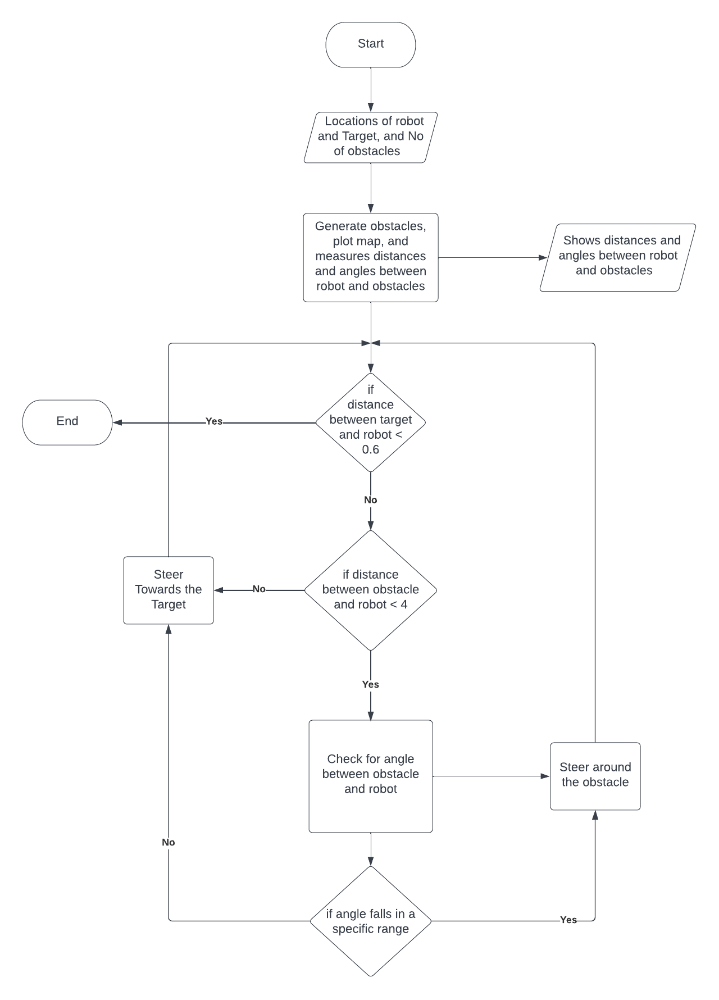

# Assesment 3
>Implement and document a software for autonomous navigation of a simulated mobile robot towards a target within a map of randomly generated obstacles. 

### The inputs used:
- ***pos_x:*** intial position x of robot
- ***pos_y:*** intial position y of robot
- ***pos_z:*** intial position z of robot
- ***goal_pos_x:*** enter x position of the target
- ***goal_pos_y:*** enter y position of the target
- ****obstacles:*** number of obstacles

## Expected Outputs
- **The distance between the robot and the target.**
- **The angle between the robot and the target.**
- **Coordinates of randomly placed targets.**
- **A display of the map containing the robot, obstacles and the target showing robot the avoiding the obstacles to reach the target.**

## Functionality of the Code
The code shows a simulation of robot placed on the map according to an input of coordinates choosen by the user where the robot avoids a number of randomly placed obstacles. The number of these randomly placed obstacles is choosen by the user. The robot avoids all the obstacles till it reaches the target that the user has choosen its coordinates.  

## Software versions
- **Ubuntu : 18.4**
- **Python : 3.6.9** 
- **Visual studio code : 1.64.2**

## Thought Process
An obstacle could be approached by the robot at different angles, so the robot needs to differently avoid these obstacles according to these angles. The follwoing image shows the thought process of implementing an obstacle avoiding code technique showing the different possible angles the robot may approach an obstacle with and  the steering angles it would have to take to avoidi.


## Flowchart


## Results, Supporting Files and Graphics
- **The robot navigates to the target choosen while avoiding any obstacle in its path to the target.**


## Further Improvement
- **The robot needs to identify if there is an obstacle present on the target and avoid it.**
- **The robot needs to avoid many targets placed together more accurately**
- **The robot needs to identify if there is any obstacles on the starting point and avoid it**
- **The robot needs stay inside the grid since it can exit the grid sometimes** 
- **Draw a line path for the robot where the line path avoids the obstacles and reachs the target**


## Code 
``` #Importing libraries
import matplotlib.pyplot as plt  
from roboticstoolbox import Bicycle, RandomPath, VehicleIcon, RangeBearingSensor, LandmarkMap
from math import atan2, pi, cos, sin


#Initializing the position X of the robot
while(True):
    pos_x = int(input('Enter initial X position of the robot: \n'))   
    if((pos_x > 20) or (pos_x < -20) ):
        print('Please enter a number between -20 and 20 \n')
    else:
        break


#Initializing the position Y of the robot
while(True):
    pos_y = int(input('Enter initial Y position of the robot: \n'))   
    if((pos_y > 20) or (pos_y < -20) ):
        print('Please enter a number between -20 and 20 \n')
    else:
        break


#Initializing the angle of the robot
pos_z = int(input('Enter initial angle of the robot: \n'))          


#Setting Target X Location
while(True):
    goal_pos_x = int(input('Enter X position of the target: \n'))   
    if((goal_pos_x > 20) or (goal_pos_x < -20) ):
        print('Please enter a number between -20 and 20 \n')
    else:
        break


#Setting Target Y Location
while(True): 
    goal_pos_y = int(input('Enter Y position of the target: \n'))   
    if((goal_pos_y > 20) or (goal_pos_y < -20) ):
        print('Please enter a number between -20 and 20 \n')
    else:
        break


#Choosong number of obstacles to be randomly placed
no_of_obstacles = int(input('Enter jumber of obstacles: \n'))    


#Adding a vehicle icon and adjusting it scale
anim = VehicleIcon("robot.png",scale = 3 )    
veh = Bicycle(
    animation = anim,
    control = RandomPath,
    dim = 10,
    x0 = (pos_x, pos_y, pos_z)
    )
veh.init(plot=True)


#Setting goal and its marker style
goal=[goal_pos_x, goal_pos_y];    
goal_marker_style = {
 'marker': 'D',
 'markersize': 6, 
 'color': 'b',
}
plt.plot(goal[0], goal[1], **goal_marker_style)


#Adding Random obstacles
map = LandmarkMap(20, 20)   
map.plot()


#Using RangebearingSensor to read distances and angles between robot and obstacles
sensor=RangeBearingSensor(robot=veh,map=map,animate=True)    


#Reading distances between robot and obstacles
def read_distances(x):
    distances = [i[0] for i in x]
    return distances


#Reading angles between robot and obstacles in radians
def read_angles(y):
    angles = [i[1]*(180/pi) for i in y]
    return angles


#Finding coordinates of the obstacles
def coordinates(x, y):
    x_coor = [x[0] + (i[0]*cos(i[1])) for i in y]
    y_coor = [x[1] + (i[0]*sin(i[1])) for i in y]
    final_coor = [x_coor + y_coor]
    print('Coordinates of the obstacles: \n {}' .format(final_coor))
    return final_coor


#Obstacle avoiding function
def avoid(run):   
    goal_heading = atan2(    #Steering the robot towards the target goal
    goal[1] - veh.x[1], 
    goal[0] - veh.x[0]
    )
    steer = goal_heading-veh.x[2]     
    for i in sensor.h(veh.x):
        if(i[0] < 4):
            step = True   #Adding a condition to condition to exit the loop when needed
            while(step):            
                for j in sensor.h(veh.x):      #Setting conditions to avoid obstacles according to the angles between them and the robot
                    if((j[1] > pi/4) and (j[1] < pi/2) ):  
                        veh.step(0.125, pi/3 + j[1])
                        step = False
                    elif((j[1] < pi/4) and (j[1] > 0)):
                        veh.step(0.125, pi/3 - j[1])
                        step = False
                    elif((j[1] < (3*(pi/4))) and (j[1] > pi/2)):
                        veh.step(0.125, -3*(pi/3) + j[1])
                        step = False
                    elif((j[1] > (3*(pi/4))) and (j[1] > pi)):
                        veh.step(0.125, 3*(pi/3) - j[1])
                        step = False
                    elif((j[1] < -pi/2) and (j[1] > (-3*(pi/4)))):
                        veh.step(0.125, pi/3 + j[1])
                        step = False
                    elif((j[1] < -(3*(pi/4))) and (j[1] > -pi)):
                        veh.step(0.125, -pi/3 + j[0] )
                        step = False
                    elif((j[1] > -pi/4 and (j[1] < 0 ))): 
                        veh.step(0.125, pi/3 + j[1])     
                        step = False
                    elif((j[1] < -pi/4) and (j[1] > -pi/4)):
                        veh.step(0.125, -pi/3 + j[1])    
                        step = False              

                veh._animation.update(veh.x)
                plt.pause(0.005)
                break
            
        else:
            veh.step(0.2,steer)
            veh._animation.update(veh.x)
    plt.pause(0.005)
    return run

run  = True   #Run condition to stop the robot when it reaches its goal


while(run):
    goal_heading = atan2(
    goal[1] - veh.x[1], 
    goal[0] - veh.x[0]
    )
    steer = goal_heading-veh.x[2]
    if((abs(goal[0]-veh.x[0]) > 0.6) or (abs(goal[1]-veh.x[1]) > 0.6)):
        run=True
    else:
        run=False
    avoid(run)

coordinates([pos_x, pos_y], sensor.h(veh.x) )
    
plt.pause(100)

print(veh.x) ```
